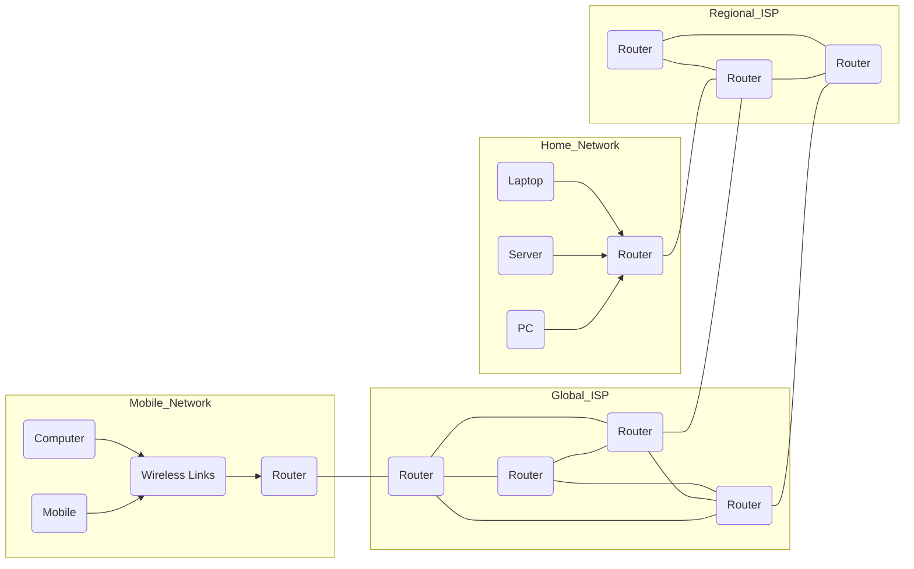
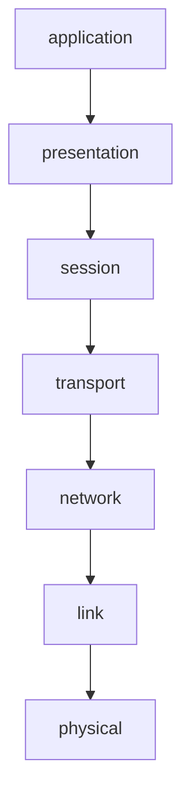

# Course Outline

| Week | Lecture                                    | Lab                                               | Assignments                           |
| ---- | ------------------------------------------ | ------------------------------------------------- | ------------------------------------- |
| 1    | Computer Networks & the Internet           | WS Intro WS HTTP                             |                                       |
| 2    | Principles of Nw Apps HTTP, SMTP, DNS | WS DNS                                            |                                       |
| 3    | Application Layer P2P, CDN, Sockets   | WS SMTP                                           |                                       |
| 4    | **Guest Lecture** Networking at UQ    | WS DHCP                                           |                                       |
| 5    | Transport Layer UDP                   | WS UDP                                            | Assignment 1 Due Friday 23 March |
| 6    | Transport Layer TCP                   | WS TCP                                            |                                       |
|      | *Midsem Break (two weeks)*                 |                                                   |                                       |
| 7    | Network Layer Data Plane              | WS IP                                             |                                       |
| 8    | Network Layer Control Plane           | No Labs Wed Assignment Consult Mon, Tue, Fri | Assignment 2 Due Friday 27 April |
| 9    | Link Layer                                 | WS ICMP                                           |                                       |
| 10   | No Lecture *(Holiday)*                     | WS ARP                                            |                                       |
| 11   | Wireless & Mobile                          | WS WiFi                                           |                                       |
| 12   | Security                                   | WS SSL                                            |                                       |
| 13   | Multimedia                                 | Assignment Consultation                           | Assignment 3 Due Friday 1 June   |

# Introduction

**Our Goal:**

- Get "feel" and terminology
- More depth, detail *later* in course
- Approach:
  - Use Internet as example

**Overview:**

- What's the Internet?
- What's a protocol
- Network edge; hosts, access net, physical media
- Network core: packet/circuit switching, Internet structure
- Performance: loss, delay, throughput
- Security
- Protocol Layers, service models
- History

## What's the Internet

### "nuts and bolts" view

- Billions of connected computing devices:
  - ==hosts== = ==end systems==
  - running ==network apps==
- ==Communcation links==
  - fiber, copper, radio, satellite
  - transmission rate: ==bandwidth==
- ==Packet switches:== forward packets (chunks of data)
  - ==routers== and ==switches==

- ==Internet: "network of networks"==
  - Interconnected ISPs
- ==Protocols== control sending, receiving of messages
  - *e.g. TCP, IP, HTTP, Skype, 802.11*
- ==Internet Standards==
  - RFC: Request for comments
  - IETF: Internet Engineering Task Force

### A Service View

- ==Infrastructure that provides services to applications:==
  - Web, VoIP, email, games, e-commerce, social nets, ...
- ==Provides programming interface to apps==
  - hooks that allow sending and receiving app programs to "connect" to Internet
  - provides service options, analogous to postal service

### What's a protocol?

**Human protocols:**

- "What's the time?"
- "I have a question"
- Introductions

> … specific messages sent
>
> … specific actions taken when messages received, or other events

**Network protocols:**

- Machines rather than humans
- All communication activity in Internet governed by protocols

> **Protocols** define **format**, **order** of **messages sent and received** among network entities, and **actions taken** on message transmission, receipt

## Network Edge

### A Closer Look at Network Structure

- ==Network edge:==
  - hosts: clients and servers
  - servers often in data centers
- ==Access networks, physical media:== wired, wireless communication links
- ==Network core:==
  - interconnected routers
  - network of networks

### Access networks and physical media

**How to connect end systems to edge router?**

- residential access nets
- institutional access networks (school, company)
- mobile access networks

**Keep in mind:**

- bandwidth (bits per second) of access network?
- shared or dedicated?

### Access Network

#### Digital Subscriber Line (DSL)

- Use ==existing== telephone line to central office DSLAM
  - data over DSL phone line goes to Internet
  - voice over DSL phone line goes to telephone net
- < 2.5 Mbps upstream transmission rate (typically < 1 Mbps)
- < 24 Mbps downstream transmission rate (typically < 10 Mbps)

#### Cable Network

==frequency division multiplexing:== different channels transmitted in different frequency bands

- **HFC: hybrid fiber coax**
  - asymmetric: up to 30Mbps downstream transmission rate, 2Mbps upstream transmission rate
- **Network** of cable, fiber attaches homes to ISP router
  - homes ==share access network== to cable headend
  - unlike DSL, which has dedicated access to central office

### Wireless Access Networks

- Shared *wireless* access network connects end system to router
  - via base station aka "access point"

**Wireless LANs:**

- within building (100 ft)
- 802.11b/g/n (WiFi): 11, 54, 450 Mbps

**Wide-Area Wireless Access**

- Provided by telco (cellular) operator, 10's km
- Between 1 and 10 Mbps
- 3G, 4G, LTE

### Host: sends *packets* of data

host sending function:

- Takes application message
- Breaks into smaller chunks, known as ==packets== of length ==L== bits
- Transmits packet into access network at ==transmission rate R==
  - link transmission rate, aka link ==capacity, aka link bandwidth==

$$
\text{packet transmission delay} = \text{time needed to transmit }L\text{-bit packet into link} = \frac{L\text{ (bits)}}{R\text{ (bits/sec)}}
$$

### Physical Media

- ==bit:== propagates between transmitter/receiver pairs
- ==physcial link:== what lies between transmitter & receiver
- ==guided media:==
  - signals propagate in solid media: copper, fiber coax
- ==unguided media:==
  - signals propagate freely, e.g. radio

**Twisted pair (TP)**

- Two insulated copper wires
  - Category 5: 100Mbps, 1 Gbps Ethernet
  - Category 6: 10Gbps

#### Coax, Fiber

**Coaxial Cable:**

- two concentric copper conductors
- bidirectional
- broadband:
  - multiple channels on cable
  - HFC

**Fiber Optic Cable:**

- glass fiber carrying light pulses, each pulse a bit
- high-speed operations:
  - high-speed point-to-point transmission (e.g. 10's-100's Gbps transmission rate)
- low error rate:
  - repeaters spaced far apart
  - immune to electromagnetic noise

#### Radio

- signal carried in electromagnetic spectrum
- no physical "wire"
- bidirectional
- propagation environment effects:
  - reflection
  - obstruction by objects
  - interference

**Radio Link Types:**

- ==terrestrial microwave==
  - e.g. up to 45 Mbps
- ==LAN== (e.g. WiFi)
  - 54Mbps
- ==wide-area== (e.g. cellular)
  - 4G cellular: ~10Mbps
- ==satellite==
  - Kbps to 45Mbps channel (or multiple smaller channels)
  - 270 msec end-end delay
  - geosynchronous versus low altitude

## Network Core

- mesh of interconnected routers
- *packet-switching: hosts break application-layer messages into packets*
  - forward packets from one router to the next, across links on path from source to destination
  - each packet transmitted at full link capacity

### Packet-switching

#### Store-and-Forward

- takes L/R seconds to transmit (push out) $L$-bit packet into link at $R$ bps
- *store-and-forward:* entry packet must arrive at router before it can be transmitted on next link
- end-end delay = $2\frac{L}{R}$ (assuming zero propagation delay)

#### Queueing delay, loss

- if arrival rate (in bits) to link exceeds transmission rate of link for a period of time:
  - packets will queue, wait to be transmitted on link
  - packets can be dropped (lost) if memory (buffer) fills up

### Two key network-core functions

- **Routing:** determines source-destination route taken by packets
- **Forwarding:** move packets from router's input to appropriate router output

### Alternative Core

#### Circuit Switching

> End-end resources allocated to, reserved for "call" between source and dest:

- dedicated resources: no sharing
  - circuit-like (guaranteed) performance
- circuit segment idle if not used by call *(no sharing)*
- commonly used in traditional telephone networks

### Circuit Switching

#### FDM versus TDM

### Packet Switching Versus Circuit Switching

> packet switching allows more users to use network

**Is packet switching a "slam dunk winner?"**

- Great for bursty data
  - resource sharing
  - simpler, no call setup
- ==excessive congestion possible:== packet delay and loss
  - protocols needed for reliable data transfer, congestion control
- *Q: How to provide circuit-like behaviour?*
  - bandwidth guarantees needed for audio/video apps
  - still an unsolved problem

### Internet Structure

#### Network of Networks

- End systems connect to Internet via ==access ISPs== (Internet Service Providers)
  - residential, company and university ISPs
- Access ISPs in turn must be interconnected
  - so that any two hosts can send packets to each other
- Resulting network of networks is very complex
  - evolution was driven by ==economics== and ==national policies==
- At center: small number of well-connected large networks
  - =="tier-1" commercial ISPs== (e.g. Level 3, Sprint, AT&T, NTT), national and international coverage
  - ==content provider network== (e.g. Google): private network that connects it's data centers to Internet, often bypassing tier-1, regional ISPs

## Delay, Loss, Throughput in Networks

### How do loss and delay occur?

packets *queue* in router buffers

- *packet arrival rate to link (temporarily) exceeds output link capacity*
- packets queue, wait for turn

### Four sources of packet delay

$$
d_\text{nodal} = d_\text{proc} + d_\text{queue} + d_\text{trans} + d_\text{prop}
$$

**$d_\text{proc}$: nodal processing**

- check bit errors
- determine output link
- typically < msec

**$d_\text{queue}$: queueing delay**

- time waiting at output link for transmission
- depends on congestion level of router

**$d_\text{trans}$: transmission delay**

- $L$: packet length (bits)
- $R$: link *bandwidth* (bps)
- $d_\text{trans} = \frac{L}{R}$

**$d_\text{prop}$: propagation delay**

- $d$: length of physical link
- $s$: propagation speed ($\approx2\times10^8$ m/sec)
- $d_\text{prop}=\frac{d}{s}$

### "Real" Internet delays and routes

- what do "real" Internet delay and loss look like?
- `traceroute` program: provides delay measurement from source to router along end-end Internet path towards destination. For all $i$:
  - sends three packets that will reach router $i$ on path towards destination
  - router $i$ will return packets to sender
  - sender times interval between transmission and reply

### Packet loss

- queue (aka buffer) preceding link in buffer has finite capacity
- packet arriving to full queue dropped (aka lost)
- lost packet may be retransmitted by previous node, by source end system, or not at all

### Throughput

- **throughput:** rate (bits/time unit) at which bits transferred between sender/receiver
  - **instantaneous:** rate at given point in time
  - **average:** rate over longer period of time

## Protocol Layers, Service Layers

**Networks are complex, with many "pieces":**

- hosts
- routers
- links of various media
- applications
- protocols
- hardware, software

**Layers:** each layer implements a service

- via its own internal-layer actions
- relying on services provided by layer below

### Why layering?

dealing with complex systems:

- explicit structure allows identification, relationship of complex system's pieces
  - layered ==reference model== for discussion
- modularization eases maintenance, updating of system
  - change of implementation of layer's service transparent to rest of system
  - e.g. change in gate procedure doesn't affect rest of system
- layering considered harmful?

### Internet protocol stack

- **Application:** supporting network applications
  - FTP, SMTP, HTTP
- **Transport:** process-process data transfer
  - TCP, UDP
- **Network:** routing of datagrams from source to destination
  - IP, routing protocols
- **Link:** data transfer between neighbouring network elements
  - Ethernet, 802.111 (WiFi), PPP
- **Physical:** bits "on the wire"

### ISO/OSI reference model

- **Presentation:** allow applications to interpret meaning of data,
  e.g. encryption, compression, machine-specific conventions
- **Session:** synchronization, checkpointing, recovery of data exchange
- Internet stack "missing" these layers!
  - these services, *if needed*, must be implemented in application
  - needed?

## Networks under attack: Security

- **Field of network security:**
  - how bad guys can attack computer networks
  - how we can defend networks against attacks
  - how to design architectures that are immune to attacks
- **Internet not originally designed with (much) security in mind**
  - *original vision:* "a group of mutually trusting users attached to a transparent network"
  - Internet protocol designers playing "catch-up"
  - security considerations in all layers

### Bad guys

#### Put malware into hosts via Internet

- malware can get in host from:
  - **virus:** self-replicating infection by receiving/executing object (e.g. e-mail attachment)
  - **worm:** self-replicating infection by passively receiving object that gets itself executed
- **spyware malware** can record keystrokes, web sites visited, upload info to collection site
- infected host can be enrolled in **botnet**, used for spam. DDoS attacks

#### Attack server, network infrastructure

**Denial of Service (DoS):** attackers make resources (server, bandwidth) unavailable to legitimate traffic by overwhelming resource with bogus traffic

1. select target
2. break into hosts around the network (see botnet)
3. send packets to target from compromised hosts

#### Bad guys can sniff packets

**packet "sniffing":**

- broadcast media (shared Ethernet, wireless)
- promiscuous network interface reads/records all packets (e.g. including passwords!) passing by
- wireshark software used for end-of-chapter labs is a (free) packet-sniffer

#### Bad guys can use fake addresses

**IP spoofing:** send packet with false source address

## History

### Internet History

> 1961-1972: Early packet-switching principles

- **1961:** Kleinrock — queueing theory shows effectiveness of packet switching
- **1964:** Baran — packet-switching in military nets
- **1967:** ARPAnet conceived by Advanced Research Projects Agency
- **1969:** first ARPAnet node operational
- **1972:**
  - ARPAnet public demo
  - NCP (Network Control Protocol) first host-host protocol
  - first e-mail program
  - ARPAnet has 15 nodes

> 1972-1980: Internetworking, new and proprietary nets

- **1970:** ALOHAnet satellite network in Hawaii
- **1974:** Cerf and Kahn — architecture for interconnecting networks
- **1976:** Ethernet at Xerox PARC
- **late 70's:** propietary architectures; DECnet, SNA, XNA
- **late 70's:** switching fixed length packets (ATM precursor)
- **1979:** ARPAnet has 200 nodes

> **Cerf and Kahn's internetworking principles:**
>
> - minimalism, autonomy — no internal changes required to interconnect networks
> - best effort service model
> - stateless routers
> - decentralised control
>
> define today's Internet architecture

> 1980-1990: new protocols, a proliferation of networks

- **1983:** deployment of TCP/IP
- **1982:** smtp e-mail protocol defined
- **1983:** DNS defined for name-to-IP-address translation
- **1985:** ftp protocol defined
- **1988:** TCP congestion control
- new national networks: CSnet, BITnet, NSFnet, Minitel
- 100,000 hosts connected to confederation of networks

> 1990, 2000's: commercialization, the Web, new apps

- **early 1990's:** ARPAnet decommissioned
- **1991:** NSF lifts restrictions on commercial use of NSFnet (decommissioned, 1995)
- **early 1990s:** Web
  - hypertext (Bush 1945, Nelson 1960's)
  - HTML, HTTP: Berners-Lee
  - 1994: Mosaic, later Netscape
  - late 1990's:
    commercialization of the Web
- **late 1990's — 2000's:**
  - more killer apps: instant messaging, P2P file sharing
  - network security to forefront
  - est. 50 million host, 100 million+ users
  - backbone links running at Gbps

> 2005-present

- ~5B devices attached to Internet (2016)
  - smartphones and tablets
- aggressive deployment of broadband access
- increasing ubiquity of high-speed wireless access
- emergence of online social networks:
  - Facebook: ~ one billion users
- service providers (Google, Microsoft) create their own networks
  - bypass Internet, providing "instantaneous" access to search, video content, email, etc
- e-commerce, universities, enterprises running their services in "cloud" (e.g. Amazon EC2)

