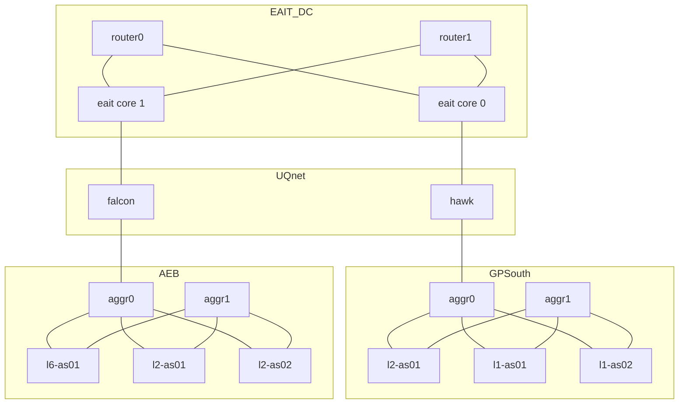
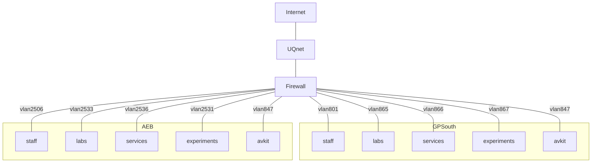

# Course Outline

| Week | Lecture                                    | Lab                                               | Assignments                           |
| ---- | ------------------------------------------ | ------------------------------------------------- | ------------------------------------- |
| 1    | Computer Networks & the Internet           | WS Intro WS HTTP                             |                                       |
| 2    | Principles of Nw Apps HTTP, SMTP, DNS | WS DNS                                            |                                       |
| 3    | Application Layer P2P, CDN, Sockets   | WS SMTP                                           |                                       |
| 4    | **Guest Lecture** Networking at UQ    | WS DHCP                                           |                                       |
| 5    | Transport Layer UDP                   | WS UDP                                            | Assignment 1 Due Friday 23 March |
| 6    | Transport Layer TCP                   | WS TCP                                            |                                       |
|      | *Midsem Break (two weeks)*                 |                                                   |                                       |
| 7    | Network Layer Data Plane              | WS IP                                             |                                       |
| 8    | Network Layer Control Plane           | No Labs Wed Assignment Consult Mon, Tue, Fri | Assignment 2 Due Friday 27 April |
| 9    | Link Layer                                 | WS ICMP                                           |                                       |
| 10   | No Lecture *(Holiday)*                     | WS ARP                                            |                                       |
| 11   | Wireless & Mobile                          | WS WiFi                                           |                                       |
| 12   | Security                                   | WS SSL                                            |                                       |
| 13   | Multimedia                                 | Assignment Consultation                           | Assignment 3 Due Friday 1 June   |

# Introduction

**Our Goal:**

- Get "feel" and terminology
- More depth, detail *later* in course
- Approach:
  - Use Internet as example

**Overview:**

- What's the Internet?
- What's a protocol
- Network edge; hosts, access net, physical media
- Network core: packet/circuit switching, Internet structure
- Performance: loss, delay, throughput
- Security
- Protocol Layers, service models
- History

## What's the Internet

### "nuts and bolts" view

- Billions of connected computing devices:
  - ==hosts== = ==end systems==
  - running ==network apps==
- ==Communcation links==
  - fiber, copper, radio, satellite
  - transmission rate: ==bandwidth==
- ==Packet switches:== forward packets (chunks of data)
  - ==routers== and ==switches==

- ==Internet: "network of networks"==
  - Interconnected ISPs
- ==Protocols== control sending, receiving of messages
  - *e.g. TCP, IP, HTTP, Skype, 802.11*
- ==Internet Standards==
  - RFC: Request for comments
  - IETF: Internet Engineering Task Force

### A Service View

- ==Infrastructure that provides services to applications:==
  - Web, VoIP, email, games, e-commerce, social nets, ...
- ==Provides programming interface to apps==
  - hooks that allow sending and receiving app programs to "connect" to Internet
  - provides service options, analogous to postal service

### What's a protocol?

**Human protocols:**

- "What's the time?"
- "I have a question"
- Introductions

> … specific messages sent
>
> … specific actions taken when messages received, or other events

**Network protocols:**

- Machines rather than humans
- All communication activity in Internet governed by protocols

> **Protocols** define **format**, **order** of **messages sent and received** among network entities, and **actions taken** on message transmission, receipt

## Network Edge

### A Closer Look at Network Structure

- ==Network edge:==
  - hosts: clients and servers
  - servers often in data centers
- ==Access networks, physical media:== wired, wireless communication links
- ==Network core:==
  - interconnected routers
  - network of networks

### Access networks and physical media

**How to connect end systems to edge router?**

- residential access nets
- institutional access networks (school, company)
- mobile access networks

**Keep in mind:**

- bandwidth (bits per second) of access network?
- shared or dedicated?

### Access Network

#### Digital Subscriber Line (DSL)

- Use ==existing== telephone line to central office DSLAM
  - data over DSL phone line goes to Internet
  - voice over DSL phone line goes to telephone net
- < 2.5 Mbps upstream transmission rate (typically < 1 Mbps)
- < 24 Mbps downstream transmission rate (typically < 10 Mbps)

#### Cable Network

==frequency division multiplexing:== different channels transmitted in different frequency bands

- **HFC: hybrid fiber coax**
  - asymmetric: up to 30Mbps downstream transmission rate, 2Mbps upstream transmission rate
- **Network** of cable, fiber attaches homes to ISP router
  - homes ==share access network== to cable headend
  - unlike DSL, which has dedicated access to central office

### Wireless Access Networks

- Shared *wireless* access network connects end system to router
  - via base station aka "access point"

**Wireless LANs:**

- within building (100 ft)
- 802.11b/g/n (WiFi): 11, 54, 450 Mbps

**Wide-Area Wireless Access**

- Provided by telco (cellular) operator, 10's km
- Between 1 and 10 Mbps
- 3G, 4G, LTE

### Host: sends *packets* of data

host sending function:

- Takes application message
- Breaks into smaller chunks, known as ==packets== of length ==L== bits
- Transmits packet into access network at ==transmission rate R==
  - link transmission rate, aka link ==capacity, aka link bandwidth==

$$
\text{packet transmission delay} = \text{time needed to transmit }L\text{-bit packet into link} = \frac{L\text{ (bits)}}{R\text{ (bits/sec)}}
$$

### Physical Media

- ==bit:== propagates between transmitter/receiver pairs
- ==physcial link:== what lies between transmitter & receiver
- ==guided media:==
  - signals propagate in solid media: copper, fiber coax
- ==unguided media:==
  - signals propagate freely, e.g. radio

**Twisted pair (TP)**

- Two insulated copper wires
  - Category 5: 100Mbps, 1 Gbps Ethernet
  - Category 6: 10Gbps

#### Coax, Fiber

**Coaxial Cable:**

- two concentric copper conductors
- bidirectional
- broadband:
  - multiple channels on cable
  - HFC

**Fiber Optic Cable:**

- glass fiber carrying light pulses, each pulse a bit
- high-speed operations:
  - high-speed point-to-point transmission (e.g. 10's-100's Gbps transmission rate)
- low error rate:
  - repeaters spaced far apart
  - immune to electromagnetic noise

#### Radio

- signal carried in electromagnetic spectrum
- no physical "wire"
- bidirectional
- propagation environment effects:
  - reflection
  - obstruction by objects
  - interference

**Radio Link Types:**

- ==terrestrial microwave==
  - e.g. up to 45 Mbps
- ==LAN== (e.g. WiFi)
  - 54Mbps
- ==wide-area== (e.g. cellular)
  - 4G cellular: ~10Mbps
- ==satellite==
  - Kbps to 45Mbps channel (or multiple smaller channels)
  - 270 msec end-end delay
  - geosynchronous versus low altitude

## Network Core

- mesh of interconnected routers
- *packet-switching: hosts break application-layer messages into packets*
  - forward packets from one router to the next, across links on path from source to destination
  - each packet transmitted at full link capacity

### Packet-switching

#### Store-and-Forward

- takes L/R seconds to transmit (push out) $L$-bit packet into link at $R$ bps
- *store-and-forward:* entry packet must arrive at router before it can be transmitted on next link
- end-end delay = $2\frac{L}{R}$ (assuming zero propagation delay)

#### Queueing delay, loss

- if arrival rate (in bits) to link exceeds transmission rate of link for a period of time:
  - packets will queue, wait to be transmitted on link
  - packets can be dropped (lost) if memory (buffer) fills up

### Two key network-core functions

- **Routing:** determines source-destination route taken by packets
- **Forwarding:** move packets from router's input to appropriate router output

### Alternative Core

#### Circuit Switching

> End-end resources allocated to, reserved for "call" between source and dest:

- dedicated resources: no sharing
  - circuit-like (guaranteed) performance
- circuit segment idle if not used by call *(no sharing)*
- commonly used in traditional telephone networks

### Circuit Switching

#### FDM versus TDM

### Packet Switching Versus Circuit Switching

> packet switching allows more users to use network

**Is packet switching a "slam dunk winner?"**

- Great for bursty data
  - resource sharing
  - simpler, no call setup
- ==excessive congestion possible:== packet delay and loss
  - protocols needed for reliable data transfer, congestion control
- *Q: How to provide circuit-like behaviour?*
  - bandwidth guarantees needed for audio/video apps
  - still an unsolved problem

### Internet Structure

#### Network of Networks

- End systems connect to Internet via ==access ISPs== (Internet Service Providers)
  - residential, company and university ISPs
- Access ISPs in turn must be interconnected
  - so that any two hosts can send packets to each other
- Resulting network of networks is very complex
  - evolution was driven by ==economics== and ==national policies==
- At center: small number of well-connected large networks
  - =="tier-1" commercial ISPs== (e.g. Level 3, Sprint, AT&T, NTT), national and international coverage
  - ==content provider network== (e.g. Google): private network that connects it's data centers to Internet, often bypassing tier-1, regional ISPs

## Delay, Loss, Throughput in Networks

### How do loss and delay occur?

packets *queue* in router buffers

- *packet arrival rate to link (temporarily) exceeds output link capacity*
- packets queue, wait for turn

### Four sources of packet delay

$$
d_\text{nodal} = d_\text{proc} + d_\text{queue} + d_\text{trans} + d_\text{prop}
$$

**$d_\text{proc}$: nodal processing**

- check bit errors
- determine output link
- typically < msec

**$d_\text{queue}$: queueing delay**

- time waiting at output link for transmission
- depends on congestion level of router

**$d_\text{trans}$: transmission delay**

- $L$: packet length (bits)
- $R$: link *bandwidth* (bps)
- $d_\text{trans} = \frac{L}{R}$

**$d_\text{prop}$: propagation delay**

- $d$: length of physical link
- $s$: propagation speed ($\approx2\times10^8$ m/sec)
- $d_\text{prop}=\frac{d}{s}$

### "Real" Internet delays and routes

- what do "real" Internet delay and loss look like?
- `traceroute` program: provides delay measurement from source to router along end-end Internet path towards destination. For all $i$:
  - sends three packets that will reach router $i$ on path towards destination
  - router $i$ will return packets to sender
  - sender times interval between transmission and reply

### Packet loss

- queue (aka buffer) preceding link in buffer has finite capacity
- packet arriving to full queue dropped (aka lost)
- lost packet may be retransmitted by previous node, by source end system, or not at all

### Throughput

- **throughput:** rate (bits/time unit) at which bits transferred between sender/receiver
  - **instantaneous:** rate at given point in time
  - **average:** rate over longer period of time

## Protocol Layers, Service Layers

**Networks are complex, with many "pieces":**

- hosts
- routers
- links of various media
- applications
- protocols
- hardware, software

**Layers:** each layer implements a service

- via its own internal-layer actions
- relying on services provided by layer below

### Why layering?

dealing with complex systems:

- explicit structure allows identification, relationship of complex system's pieces
  - layered ==reference model== for discussion
- modularization eases maintenance, updating of system
  - change of implementation of layer's service transparent to rest of system
  - e.g. change in gate procedure doesn't affect rest of system
- layering considered harmful?

### Internet protocol stack

- **Application:** supporting network applications
  - FTP, SMTP, HTTP
- **Transport:** process-process data transfer
  - TCP, UDP
- **Network:** routing of datagrams from source to destination
  - IP, routing protocols
- **Link:** data transfer between neighbouring network elements
  - Ethernet, 802.111 (WiFi), PPP
- **Physical:** bits "on the wire"

### ISO/OSI reference model

- **Presentation:** allow applications to interpret meaning of data,
  e.g. encryption, compression, machine-specific conventions
- **Session:** synchronization, checkpointing, recovery of data exchange
- Internet stack "missing" these layers!
  - these services, *if needed*, must be implemented in application
  - needed?

## Networks under attack: Security

- **Field of network security:**
  - how bad guys can attack computer networks
  - how we can defend networks against attacks
  - how to design architectures that are immune to attacks
- **Internet not originally designed with (much) security in mind**
  - *original vision:* "a group of mutually trusting users attached to a transparent network"
  - Internet protocol designers playing "catch-up"
  - security considerations in all layers

### Bad guys

#### Put malware into hosts via Internet

- malware can get in host from:
  - **virus:** self-replicating infection by receiving/executing object (e.g. e-mail attachment)
  - **worm:** self-replicating infection by passively receiving object that gets itself executed
- **spyware malware** can record keystrokes, web sites visited, upload info to collection site
- infected host can be enrolled in **botnet**, used for spam. DDoS attacks

#### Attack server, network infrastructure

**Denial of Service (DoS):** attackers make resources (server, bandwidth) unavailable to legitimate traffic by overwhelming resource with bogus traffic

1. select target
2. break into hosts around the network (see botnet)
3. send packets to target from compromised hosts

#### Bad guys can sniff packets

**packet "sniffing":**

- broadcast media (shared Ethernet, wireless)
- promiscuous network interface reads/records all packets (e.g. including passwords!) passing by
- wireshark software used for end-of-chapter labs is a (free) packet-sniffer

#### Bad guys can use fake addresses

**IP spoofing:** send packet with false source address

## History

### Internet History

> 1961-1972: Early packet-switching principles

- **1961:** Kleinrock — queueing theory shows effectiveness of packet switching
- **1964:** Baran — packet-switching in military nets
- **1967:** ARPAnet conceived by Advanced Research Projects Agency
- **1969:** first ARPAnet node operational
- **1972:**
  - ARPAnet public demo
  - NCP (Network Control Protocol) first host-host protocol
  - first e-mail program
  - ARPAnet has 15 nodes

> 1972-1980: Internetworking, new and proprietary nets

- **1970:** ALOHAnet satellite network in Hawaii
- **1974:** Cerf and Kahn — architecture for interconnecting networks
- **1976:** Ethernet at Xerox PARC
- **late 70's:** propietary architectures; DECnet, SNA, XNA
- **late 70's:** switching fixed length packets (ATM precursor)
- **1979:** ARPAnet has 200 nodes

> **Cerf and Kahn's internetworking principles:**
>
> - minimalism, autonomy — no internal changes required to interconnect networks
> - best effort service model
> - stateless routers
> - decentralised control
>
> define today's Internet architecture

> 1980-1990: new protocols, a proliferation of networks

- **1983:** deployment of TCP/IP
- **1982:** smtp e-mail protocol defined
- **1983:** DNS defined for name-to-IP-address translation
- **1985:** ftp protocol defined
- **1988:** TCP congestion control
- new national networks: CSnet, BITnet, NSFnet, Minitel
- 100,000 hosts connected to confederation of networks

> 1990, 2000's: commercialization, the Web, new apps

- **early 1990's:** ARPAnet decommissioned
- **1991:** NSF lifts restrictions on commercial use of NSFnet (decommissioned, 1995)
- **early 1990s:** Web
  - hypertext (Bush 1945, Nelson 1960's)
  - HTML, HTTP: Berners-Lee
  - 1994: Mosaic, later Netscape
  - late 1990's:
    commercialization of the Web
- **late 1990's — 2000's:**
  - more killer apps: instant messaging, P2P file sharing
  - network security to forefront
  - est. 50 million host, 100 million+ users
  - backbone links running at Gbps

> 2005-present

- ~5B devices attached to Internet (2016)
  - smartphones and tablets
- aggressive deployment of broadband access
- increasing ubiquity of high-speed wireless access
- emergence of online social networks:
  - Facebook: ~ one billion users
- service providers (Google, Microsoft) create their own networks
  - bypass Internet, providing "instantaneous" access to search, video content, email, etc
- e-commerce, universities, enterprises running their services in "cloud" (e.g. Amazon EC2)

# Application Layer

- conceptual, implementation aspects of network application protocols
  - transport-layer service models
  - client-server paradigm
  - *peer-to-peer paradigm*
  - *content distribution networks*
- learn about protocols by examining popular application-level protocols
  - HTTP
  - FTP
  - SMTP / POP3 / IMAP
  - DNS
- *creating network applications*
  - *socket API*

## Principles of Network Applications

### Creating a network app

**write programs that:**

- run on (different) *end systems*
- communicate over network

**no need to write software for network-core devices**

- network-core devices do not run user applications
- applications on end systems allows for rapid app development, propagation

### Application Architectures

Possible structure of applications:

- client-server
- peer-to-peer (P2P)

#### Client-server architecture

**Server:**

- Always-on host
- Permanent IP address
- Data centers for scaling

**Clients:**

- Communicate with server
- May be intermittently connected
- May have dynamic IP addresses
- Do not communicate directly with each other

#### P2P architecture

- *no* always-on server
- arbitrary end systems directly communicate
- peers request service from other peers, provide service in return to other peers
  - *self scalability* — new peers bring new service capacity, as well as new service demands
- peers are intermittently connected and change IP addresses
  - complex management

### Process Communicating

**Process:** program running within a host

- within same host, two processes communicate using ==inter-process communication== (defined by OS)
- processes in different hosts communicate by exchange **messages**

> clients, servers
>
> **client process:** process that initiates communication
> **server process:** process that waits to be contacted

- aside: applications with P2P architectures have client processes and server processes

### Sockets

- process sends/receives messages to/from its **socket**
- socket analogous to door
  - sending process shoves message out door
  - sending process relies on transport infrastructure on other side of door to deliver message to socket at receiving process

### Addressing processes

- to receive messages, process must have **identifier**
- host device has unique 32-bit IP address
- **identifier** includes both **IP address** and **port numbers** on host

#### App-layer protocol defines

- **types of messages exchanged**
  - e.g. request, response
- **message syntax:**
  - what fields in messages and how fields are delineated
- **message semantics**
  - meaning of information in fields
- **rules** for when and how processes send and respond to messages

**open protocols:**

- defined in RFCs
- allows for interoperability
- e.g. HTTP, SMTP

**proprietary protocols:**

- e.g. Skype

#### What transport service does an app need?

**Data Integrity**

- Some apps (e.g. file transfer, web transactions) require 100% reliable data transfer
- Other apps (e.g. audio) can tolerate some loss

**Timing**

- Some apps (e.g. Internet telephony, interactive games) require low delay to be "effective"

**Throughput**

- Some apps (e.g. multimedia) require minimum amoutn of throughput to be "effective"
- Other apps ("elastic apps") make use of whatever throughput they get **security**
- encryption, data integrity, ...

##### Transport service requirements

###### Common Apps

| Application           | Data Loss     | Throughput                                  | Time Sensitive  |
| --------------------- | ------------- | ------------------------------------------- | --------------- |
| file transfer         | no loss       | elastic                                     | no              |
| e-mail                | no loss       | elastic                                     | no              |
| Web documents         | no loss       | elastic                                     | no              |
| real-time audio/video | loss-tolerant | audio: 5kbps-1Mbps video: 10kbps-5Mbps | yes, 100's msec |
| stored audio/video    | loss-tolerant | same as above                               | yes, few secs   |
| interactive games     | loss-tolerant | few kbps up                                 | yes, 100's msec |
| text messaging        | no loss       | elastic                                     | yes and no      |

##### Internet transport protocols services

###### TCP service:

- **reliable transport** between sending and receiving process
- **flow control:** sender won't overwhelm receiver
- **congestion control:** throttle sender when network overloaded
- **does not provide:** timing, minimum throughput guarantee, security
- **connection-oriented:** setup required between client and server process

###### UDP service

- **unreliable data transfer** between sending and receiving process
- **does not provide:** reliability, flow control, congestion control, timing, throughput guarentee, security, or connection setup

### Internet apps

#### Application, transport protocols

| Application            | Application Layer Protocol          | Underlying Transport Protocol |
| ---------------------- | ----------------------------------- | ----------------------------- |
| e-mail                 | SMTP [RFC 2821]                     | TCP                           |
| remote terminal access | Telnet [RFC 854]                    | TCP                           |
| Web                    | HTTP [RFC 2616]                     | TCP                           |
| file transfer          | FTP [RFC 959]                       | TCP                           |
| streaming multimedia   | HTTP (e.g. Youtube), RTP [RFC 1889] | TCP or UDP                    |
| Internet telephony     | SIP, RTP, proprietary (e.g. Skype)  | TCP or UDP                    |

##### Securing TCP

###### TCP and UDP

- no encryption
- cleartext passwords sent into socket traverse Internet in cleartext

###### SSL

- provides encrypted TCP connection
- data integrity
- end-point authenication

###### SSL is at app layer

- apps use SSL libraries, that "talk" to TCP

###### SSL socket API

- cleartext passwords sent into socket traverse Internet encrypted

## Web and HTTP

- **web page** consists of **objects**
- object can be HTML file, JPEG image, Java applet, audio file, ...
- web page consists of **base HTML-file** which includes **several referenced objects**
- each object is addressable by a **URL**

### HTTP overview

**HTTP: hypertext transfer protocol**

- Web's application layer protocol
- client/server model
  - **client:** browser that requests, receives, (using HTTP protocol) and "displays" Web objects
  - **server:** Web server sends (using HTTP protocol) objects in response to requests

**uses TCP:**

- client initiates TCP connection (creagtes socket) to server, port 80
- server accepts TCP connection from client
- HTTP messages (application-layer protocol messages) exchanged between browser (HTTP client) and Web server (HTTP server)
- TCP connection closed

**HTTP is "stateless"**

- server maintains no information about past client requests

> **Protocols that maintain "state" are complax!**
>
> - past history (state) must be maintained
> - if server/client crashes, their views of "state" may be inconsistent, must be reconciled

**non-persistent HTTP**

- at most one object sent over TCP connection
  - connection then closed
- downloading multiple objects required multiple connections

**persistent HTTP**

- multiple objects can be sent over single TCP connection between client, server

#### Non-persistent HTTP: response time

> **RTT (definition):** time for a small packet to travel from client to server and back

**HTTP response time:**

- one RTT to initiate TCP connection
- one RTT for HTTP request and first few bytes of HTTP response to return
- file transmission time
- non-persistent HTTP response time = 2RTT + file transmission

#### Persistent HTTP

**non-persistent HTTP issues:**

- requires 2 RTTs per object
- OS overhead for *each* TCP connection
- browsers often open parallel TCP connections to fetch referenced objects

**persistent HTTP:**

- server leaves connection open after sending response
- subsequent HTTP messages between same client/server sent over open connection
- client sends requests as soon as it encounters a referenced object
- as little as one RTT for all the referenced objects

#### HTTP request message

- two types of HTTP messages: **request, response**
- **HTTP request message:**
  - ASCII (human-readable format)

##### Uploading form input

###### POST method

- web page often includes form input
- input is uploaded to server in entity body

###### URL method

- uses GET method
- input is uploaded in URL field of request line

##### Method types

| HTTP/1.0                                                     | HTTP/1.1                                                     |
| ------------------------------------------------------------ | ------------------------------------------------------------ |
| - GET - POST - HEAD   - asks server to leave requested object out of response | - GET, POST, HEAD - PUT   - uploads file in entity body to path specified in URL field - DELETE   - deletes file specified in the URL field |

### HTTP Response Status Codes

- status code appears in 1st line in server-to-client response message
- some sample codes:
  - `200 OK` — request succeeded, requested object later in this message
  - `301 Moved Permanently` — requested object moved, new location specified later in this message
  - `400 Bad Request` — request message not understood by server
  - `404 Not Found` — requested document not found on this server
  - `505 HTTP Version Not Supported`

### Web Caches

#### Proxy Server

**Goal:** satisfy client request without involving origin server

- user sets browser: Web accesses via cache
- browser sends all HTTP requests to cache
  - object in cache: cache returns object
  - else cache requests object from origin server, then returns object to client
- cache acts as both client and server
  - server for original requesting client
  - client to origin server
- typically cache is installed by ISP (university, company, residential ISP)

**why web caching?**

- reduce response time for client request
- reduce traffic on an institution's access link
- Internet dence with caches: enables "poor" content providers to effectively deliver content (so too does P2P file sharing)

#### Conditional GET

- **Goal:** don't send object if cache has up-to-date cached version
  - no object transmission delay
  - lower link utilization
- **cache:** specify date of cached copy in HTTP request
  `If-modified-since: <date>`
- **server:** response contains no object if cached copy is up-to-date:
  `HTTP/1.0 304 Not Modified`

## Electronic Mail

**Three major components:**

- user agents
- mail servers
- simple mail transfer protocol: SMTP

### User Agent

- a.k.a "mail reader"
- composing, editing, reading mail messages
- e.g. Outlook, Thunderbird, iPhone mail client
- outgoing, incoming messages stored on server

### Mail Servers

- **mailbox** contains incoming messages for user
- **message queue** of outgoing (to be sent) mail messages
- **SMTP protocol** between mail servers to send email messages
  - client: sending mail server
  - "server": receiving mail server

### SMTP [RFC 2821]

- uses TCP to reliably transfer email message from client to server, port 25
- direct transfer: sending server to receiving server
- three phases of transfer
  - handshaking (greeting)
  - transfer of messages
  - closure
- command/response interaction (like HTTP)
  - **commands:** ASCII text
  - **response:** status code and phrase

#### Final Notes

- messages must be in 7-bit ASCI
- SMTP uses persistent connections
- SMTP requires message (header and body) to be in 7-bit ASCII
- SMTP server uses "." to determine end of message

**comparison with HTTP:**

- HTTP: pull
- SMTP: push
- both have ASCII command/response interaction, status codes
- HTTP: each object encapsulated in its own response message
- SMTP: multiple objects sent in multipart message

### Mail access protocols

- **SMTP:** delivery/storage to receiver's server
- mail access protocol: retrieval from server
  - **POP:** Post Office Protocol [RFC 1939]: authorisation, download
  - **IMAP:** Internet Mail Access Protocol [RFC 1730]: more features, including manipulation of stored messages on server
  - **HTTP:** Gmail, Hotmail, Yahoo! Mail, etc

#### POP3 protocol

**authorization phas**

- client commands:
  - `user`: declare username
  - `pass`:  password
- server responses
  - `+OK`
  - `-ERR`

**transaction phase**, client:

- `list`: list message numbers
- `retr`: retrieve message by number
- `dele`: delete
- `quit`

- POP3 "download-and-keep": copies messages on different clients
- POP3 is stateless across sessions

#### IMAP

- keeps all messages in one place: at server
- allows user to organize messages in folders
- keeps user state across sessions:
  - name of folders and mapping between message IDs and folder name

## DNS

**people:** many identifiers:

- SSN, name, passport number

**Internet hosts, routers:**

- IP address (32 bit) — used for addressing datagrams
- "name", e.g. www.yahoo.com — used by humans

### Domain Name System

- **distributed database** implemented in hierarchy of many **name servers**
- **application-layer protocol:** hosts, name server communicate to **resolve** names (address/name translation)
  - note: core Internet function, implemented as application-layer protocol
  - complexity at network's "edge"

### Services, Structure

**DNS services**

- hostname to IP address translation
- host aliasing
  - canonical, alias names
- mail server aliasing
- load distribution
  - replicated Web servers: many IP addresses correspond to one name

**Why not centraliza DNS?** (It doesn't scale)

- single point of failure
- traffic volume
- distant centralized database
- maintenance

### A Distributed, Hierarchical database

client wants IP for www.amazon.com; 1^st^ approximation:

- client queries root server to find `com` DNS server
- client queries `.com` DNS server to get `amazon.com` DNS server
- client queries `amazon.com` DNS server to get IP address for `www.amazon.com`

### Root Name Servers

- contacted by local name server that can not resolve name
- root name server:
  - contacts authoritative name server if name mapping not known
  - get mapping
  - returns mapping to local name server

### TLD, authoritative servers

#### Top-level domain (TLD) servers

- responsible for `com`, `org`, `net`, `edu`, `aero`, `jobs`, `museums`, and all top-level country domains, e.g. `uk`, `fr`, `ca`, `jp`
- Network Solutions maintains servers for `.com` TLD
- Educause for `.edu` TLD

#### Authoritative DNS servers

- organizations's own DNS server(s), providing authoritative hostname to IP mappings for organizatin's named hosts
- can be maintained by organisation or service provider

### Local DNS name server

- does not strictly belong to hierarchy
- each ISP (residential ISP, company, university) has one
  - also called "default name server"
- when host makes DNS query, query is sent to its local DNS server
  - has local cache of recent name-to-address translation pairs (but may be out of date!)
  - acts as proxy, forwards query into hierarchy

### DNS name resolution example

- host at `cis.poly.edu` wants IP address for `gaia.cs.umass.edu`

**iterated query:**

- contacted server replies with name of server to contact
- "I don't know this name, but ask this server"

**recursive query:**

- puts burden of name resolution on contacted name server
- heavy load at uppoer levels of hierarchy?

### Caching, Updating records

- Once (any) name server learns mapping, it **caches** mapping
  - cache entries timeout (disappear) after some time (TTL)
  - TLD servers typically cached in local name servers
    - thus root name servers not often visited
- cached entries may be **out-of-date** (best effort name-to-address translation!)
  - if name host changes IP address, may not be known Internet-wide until all TTLs expire
- update/notify mechanisms proposed IETF standard
  - RFC 2136

#### DNS records

**DNS:** distributed database storing resource records **(RR)**
RR format: `(name, value, type, ttl)`

**type=A**

- `name` is hostname
- `value` is IP address

**type=NS**

- `name` is domain (e.g. foo.com)
- `value` is hostname of authoritative name server for this domain

**type=CNAME**

- `name` is alias name for some "canonical" (the real) name
- `www.ibm.com` is really `servereast.backup2.ibm.com`
- `value` is canonical name

**type=MX**

- `value` is name of mailserver associated with `name`

### DNS protocol, messages

- **query** and **reply** messages, both with same **message format**

message header

- **identification:** 16 bit number for query, reply to query uses same number
- **flags:**
  - query or reply
  - recursion desired
  - recursion available
  - reply is authoritative

### Attacking DNS

#### DDoS Attacks

- bombard root server with traffic
  - not successful to date
  - traffic filtering
  - local DNS servers cache IPs of TLD servers, allowing root server bypass
- bombard TLD servers
  - potentially more dangerous

#### Redirect Attacks

- man-in-middle
  - Intercept queries
- DNS poisoning
  - Send bogus relies to DNS server, which caches

#### Exploit DNS for DDoS

- send queries with spoofed source address: target IP
- requires amplification

## P2P Applications

### Client-server architecture

**Server:**

- always-on host
- permanent IP address
- data centres for scaling

**Clients:**

- communicate with server
- may be intermittently connected
- may have dynamic IP addresses
- do not communicate directly with each other

### P2P Architecture

- *no* always-on server
- arbitrary end systems directly communicate
- peers request service from other peers, provide service in return to other peers
  - *self scalability* — new peers bring new service capacity, as well as new service demands
- peers are intermittently connected and change IP addresses
  - complex management

### File Distribution

#### Client-server

- **server transmission:** must sequentially send (upload) $N$ file copies:
  - time to send one copy: $\frac{F}{u_s}$
  - time to send $N$ copies: $\frac{NF}{u_s}$
- **client:** each client must download file copy
  - $d_{\min}$ = min client download rate
  - min client download time: $\frac{F}{d_\min}$

> time to distribute $F$ to $N$ clients using client-server approach:
> $D_{c-s}\geq\max\left(\frac{NF}{u_s},\frac{F}{d_\min}\right)$

#### P2P

- **server transmission:** must upload at least one copy
  - time to send one copy: $\frac{F}{u_s}$
- **client:** each client must download file copy
  - min client download time: $\frac{F}{d_\min}$
- **clients:** as aggregate must download $NF$ bits
  - max upload rate (limiting max download rate) is $u_s + \sum u_i$

> time to distribute $F$ to $N$ clients using P2P approach
> $D_\text{P2P}\geq\max\left( \frac{F}{u_s}, \frac{F}{d_\min}, \frac{NF}{u_s+\sum u_i} \right)$

#### BitTorrent

- file divided into 256Kb chunks
- peers in torrent send/receive file chunks
- **tracker:** tracks peers participating in torrent
- **torrent:** group of peers exchanging chunks of a file
- peer joining torrent:
  - has no chunks, but will accumulate them over time from other peers
  - registers with tracker to get list of peers, connects to subset of peers ("neighbours")
- while downloading, peer uploads chunks to other peers
- peer may change peers with whom it exchanges chunks
- **churn:** peers may come and go
- once peer has entire file, it may (selfishly) leave or (altruistically) remain in torrent

##### Requesting, Sending file chunks

###### Requesting Chunks:

- at any given time, different peers have different subsets of file chunks
- periodically, Alice asks each peer for list of chunks that they have
- Alice requests missing chunks from peers, rarest first

###### Sending Chunks: tit-for-tat

- Alice sends chunks to those four peers currently sending her chunks *at highest rate*
  - other peers are choked by Alice (do not receive chunks from her)
  - re-evaluate top 4 every 10 seconds
- every 30 seconds: randomly select another peer, starts sending chunks
  - "optimistically unchoke" this peer
  - newly chosen peer may join top 4

## Video Streaming and Content Distribution Networks

### Multimedia

#### Video

- sequence of images displayed at constant rate
- digital image: array of pixels
  - each pixel represented by bits
- coding: use redundancy **within** and **between** images to decrease number of bits used to encode image
  - spatial (within image)
    - instead of sending $N$ values of same color (all purple), send only two values: color value (purple) and number of repeated values (N)
  - temporal (from one image to next)
    - instead of sending complete frame at $i+1$, send only differences from frame $i$
- **CBR (constant bit rate):** video encoding rate fixed
- **VBR (variable bit rate):** video encoding rate changes as amount of spatial, temporal coding changes

### Streaming Stored Video

#### Simple Scenario

Video server (stored video) &rarr; Internet &rarr; client

#### DASH

- **DASH:** Dynamic, Adaptive Streaming over HTTP
- server:
  - divides video file into multiple chunks
  - each chunk stored, encoded at different rates
  - manifest file: provides URLs for different chunks
- client:
  - periodically measures server-to-client bandwidth
  - consulting manifest, requests one chunk at a time
    - chooses maximum coding rates at different points in time (depending on available bandwidth at time)
- "intelligence" at client: client determines
  - **when** to request chunk (so that buffer starvation, or overflow does not occur)
  - **what encoding rate** to request (higher quality when more bandwidth available)
  - **where** to request chunk (can request from URL server that is "close" to client or has high available bandwidth)

### Content Distribution Networks (CDNs)

- How to stream content (selected from millions of videos) to hundreds of thousands of *simultaneous* users?
  - single, large "mega-server"
    - single point of failure
    - point of network congestion
    - long path to distant clients
    - multiple copies of video sent over outgoing link
  - store/serve multiple copies of videos at multiple geographically distributed sites *(CDN)*
    - **enter deep:** push CDN servers deep into many access networks
      - close to users
    - **bring home:** smaller number (10's) of larger clusters in IXPs near (but not within) access networks
- CDN: stores copies of content at CDN nodes
- subscriber requests content from CDN
  - directed to nearby copy, retrieves content
  - may choose different copy if network path congested
- **OTT (over the top) challenges:** coping with a congested Internet
  - from which CDN node to retrieve content?
  - viewer behaviour in presence of congestion?
  - what content to place in which CDN node?

## Socket Programming with UDP and TCP

### Socket Programming

**Socket:** door between application process and end-end-transport protocol

Two socket types for two transport services:

- **UDP:** unreliable datagram
- **TCP:** reliable, byte stream-oriented

Application Example:

1. client reads a line of characters (data) from its keyboard and sends data to server
2. server receives the data and converts characters to uppercase
3. server sends modified data to client
4. client receives modified data and displays line on its screen

#### Socket Programming ==with UDP==

UDP: no "connection" between client and server

- no handshaking before sending data
- sender explicitly attaches IP destination address and port number to each packet
- receiver extracts sender IP address and port number from received packet

UDP: transmitted data may be lost or received out-of-order

Application viewpoint: UDP provides *unreliable* transfer of groups of bytes ("datagrams") between client and server

#### Socket Programming ==with TCP==

client must contact server:

- server process must first be running
- server must have created socket (door) that welcomes client's contact

client contacts server by:

- Creating TCP socket, specifying IP address, port number of server process
- when client creates socket:
  client TCP establishes connection to server TCP
- when contacted by client, **server TCP creates new socket** for server process to communicate with that particular client
  - allows server to talk with multiple clients
  - source port numbers used to distinguish clients

**Application Viewport:** TCP provides reliable, in-order byte-stream

## Summary

- application architectures
  - client-server
- application service requirements:
  - reliability, bandwidth, delay
- Internet transport service model
  - connection-oriented, reliable: TCP
  - unreliable, datagrams: UDP
- specific protocols:
  - HTTP
  - SMTP, POP, IMAP
  - DNS
- typical request/reply message exchange:
  - client requests info or service
  - server responds with data, status code
- message formats:
  - **headers:** fields giving info about data
  - **data:** info (payload) being communicated
- typical request/reply message exchange:
  - client requests info or service
  - server responds with data, status code
- message formats:
  - **headers:** fields giving info about data
  - **data:** info(payload) being communicated

**important themes:**

- control vs. messages
  - in-band, out-of-band
- centralised vs. decentralised
- stateless vs. stateful
- reliable vs. unreliable message transfer
- "complexity at network edge"
- control vs. messages
  - in-band, out-of-band
- centralized vs. decentralized
- stateless vs. stateful
- reliable vs. unreliable message transfer
- "complexity at network edge"

# UQ Networks

- How it connects to the greater internet
- Physical infrastructure
- Protocol support
- IP networking
- Ethernet networking
- Authentication
- Firewalls
- Services

## UQ Internet

- Connected via [AARNet](https://www.aarnet.edu.au/)
  - Australia's Academic and Research Network
    - *a not-for-profit company*
    - *the shareholders are 38 Australian universities and the Australian CSIRO*
- Currently redundant 10 Gbp/s links
- Preparing for 100 Gb
- UQ has an "Internet Edge Module"
  - edge router does NAT for all of UQ
  - then a traffic and quota management system
  - then the UQ core network

## EAIT Networks

- EAIT access UQ and then Internet via the UQ Core
- UQ Core also carries EAIT client networks
- Client networks in buildings provide network for EAIT run equipment
  - staff, labs, services, experiments, avkit, walkup
- Each building gets it's own set of networks
  - $\approx12\text{ buildings }\times\text{ networks}$
- Each client network is carried from buildings, over the UQ core, to EAIT
- EAIT operate datacentres with networking

## Physical Infrastructure

- UQ is a Cisco shop, mostly
- Access layer is usually a stack of Catalyst switches
  - EAIT is mostly 3750e switches
  - Provides PoE to desk phones
  - New APs require more power, so some 3850s now
  - Usually one link each from aggr to the stack
- Aggregation layer usually single switches with optics
  - LR (long range) optics from aggr to core
  - SR (short range) optics from aggr to access
- UQ core is currently things like Cisco Catalyst 6500-Es
- eait-core is a pair of Cisco Nexus 5548UPs
  - Acts as the ToR in the DC via FEXes
- The EAIT firewall is a pair of OpenBSD boxes
  - Intel(R) Xeon(R) CPU E5-2643 0 @ 3.30GHz
  - Myricom 10G-PCIE2-8B2-2S
  - Redundant links from eait-core into firewalls

## EAIT Firewalls

- Firewalls use [CARP](https://man.openbsd.org/carp.4) on the local networks
  - Provides a single gateway IP for clients
  - One of the firewalls is the master
- Uses [pfsync](https://man.openbsd.org/pfsync.4)
  - Synchronises the state tables between firewalls
  - Supports development on production systems
- Uses OSPF to talk to UQ networks
  - a dynamic routing protocol
  - Open Shortest Path First
  - advertises EAIT networks into UQ and the Internet
  - offers multipath and failover
  - we added fast hellos

## EAIT Services

- EAIT operate a variety of server networks
  - More virtual networks from the firewall
  - Goes to ToR in a machineroom
- We run most stuff ourselves
  - e.g. our own:
    - Windows Domains, DNS/DHCP/IP management, file servers, labs, VPN server

## An EAIT service: Pervade

- Our own desktop image deployment system
- Replaced a standalone, monolithic imaging system
  - Rembo
  - lacked support for Windows 7
  - unicast was CPU bound at 80 MB/s
  - multicast deploys were slower than unicast
  - also, multicast across subnets is a lie
- Integrated into our directories, DNS, DHCP
- Distributes Windows images using BitTorrent
- Custom netbooted Linux environment
- Added hypervisor support in recent years

### Pervade

- Boot a [Buildroot](https://buildroot.org/) based Linux via [pxelinux](http://www.syslinux.org/wiki/index.php?title=PXELINUX)
- Required a rewrite of the tftp server
  - previously a process per connection via [inetd(8)](http://man.openbsd.org/inetd.8)
  - [tftpd(8)](https://man.openbsd.org/tftpd.8) is a persistent, event-driven daemon
- Uses an old version of [Bitstorm](https://github.com/inpun/bitstorm) as a tracker
  - hacked up to cope with a lot of concurrency
- Seeder was [transmission](https://transmissionbt.com/)
- Seeding is HTTP against nginx now
  - looking to move to manta
- Client is [libtorrent](https://www.libtorrent.org/)
  - hacked up to go fast
- Out networks are different to the Internet
- Ours are high bandwidth, low latency
- The internet is high latency, low bandwidth
- Most (all) bittorrent implementations are bad
  - but get away with it cos they don't have to go fast
  - the network is their bottleneck
  - our bottleneck is the disk
- The BitTorrent protocol copes with bad peers
  - we own and trust our machines
  - and can easily upgrade our software
  - unnecessary for us

## Authentication

- EAIT uses UQ usernames and passwords
  - We do not known or store any passwords
- Use upstream Kerberos for password auth
  - Used via a trust in our AD domains
  - The AD trusts support logins to Windows
  - Used on shell boxes (e.g. remote)
  - Used on our custom images on UQcloud
- Use Single Sign-On for the web
  - Used homegrown KVD for ages
  - Migrated to SAML for login
  - Still uses KVD inside EAIT
  - SSO is tied into UQcloud too

## Protocols

### Transport

- Firewall protects client networks
- It allows ping everywhere
- It blocks most connections going to clients
  - except SSH and RDP from within EAIT
- Allows TCP and UDP to UQnet and the Internet
  - except Windows File and Print sharing to the Internet
- Access to EAIT services is filtered
  - except from EAIT client nets
  - sort of, labs and staff are different
  - and sometimes UQ

### Network

- Only IPv4 is supported on client networks
- We have some IPv6 on server nets
- What else is there? IPX? AppleTalk?
- Usually run on top of Ethernet

### Link Layer

- Ethernet
- We rely on VLANs to carry EAIT networks
- UQ switches carry EAIT VLANs on every hop
- Very large broadcast domains
  - from every building over the core
  - carries a lot of risk of broadcast problems
- UQ is planning to upgrade the core
- Plans to move away from transporting Ethernet
- Probably an IP and MPLS based core
- EAIT networks could be an IP service on the UQ core
- Building aggregation will become routers
- Building networks will end at aggregation
- Multiple building networks on a single router
- IP and EtherIP tunnels need multiple IPs to tunnel multiple networks
  - Possible, but wasteful

## Ethernet

- A standard networking technology
- Standardised physical media
- Simple network protocol
- Nodes are peers on a shared medium
- Nodes have to be on the same Ethernet network to communicate
- Supports unicast, broadcast, and multicast
- Only supports the transmission of whole frames
- Each device has a 6 byte (48 bit) unicast address
  - aka, Media Access Control or MAC address
  - First 3 bytes for Organizational Unique Identifier
  - Address space allocated by [IEEE to manufacturers](http://standards-oui.ieee.org/oui.txt)
  - 3 bytes for them to assign to a device
  - 3 bytes is about 16 million
- Multicast addresses have the low bit set in the first byte
- The broadcast address is all bits set
  - a special multicast address

### Ethernet Protocol

- The important bit is the 14 byte header
- Destination and source addresses, and a 2 byte type
- The type identifies the meaning of the payload
- Nodes use their unicast address as a source
- Can send to any destination, just put it on the medium

### Ethernet Medium

- Ethernet devices are connected together somehow
- A message sent to the medium can be received by all other nodes
  - especially true for hubs
- Ethernet devices filter packets based on the destination address
  - mitigates the host itself having to filter
- However, this doesn't scale
- Flooding all traffic reduces the available bandwidth

### Ethernet Switching

- Switches snoop source addresses, and remember the last port the MAC came from
- Packets then to that address are sent only to that port
- Packets with an unknown unicast destination are flooded
- Multicast is flooded by default unless a higher level protocol is snooped
- Broadcast is flooded, as expected
- This works in multiple switch topologies
- The topology must be a strictly directed graph or tree
- Topologies with multiple links introduce loops
- Ethernet packets have no Time-To-Live
  - so loops will continue forever
  - requires intervention to resolve
- Spanning Tree Protocols (STP) detect this situation and block redundant ports
  - but provides failover
- Link aggregation (e.g. LACP) can be used too
  - turns multiple physical ports into a single logical port
  - provides redundancy and combined bandwidth
  - multi chassis aggregation generally requires vendor magic

### Ethernet Security

- No security provided by Ethernet
- Very little to stop a bad actor
- So partition Ethernet networks to provide trust domains
  - e.g. put staff and students on different Ethernet networks
- Duplicated equipment is expensive
- Modern switches offer Virtual LAN (VLAN) capabilities

#### VLANs

- A switch can be configured to provide multiple virtual Ethernet networks
- Ports are configured to be part of a VLAN
- The Ethernet broadcast domain is limited to the ports in the same VLAN
- Multiple switches and VLANs imply multiple links between switches
- Uplink ports per VLAN is expensive as you grow
- Solution is to carry VLAN information on the wire
- Ethernet type becomes "VLAN encapsulated"
- VLAN payload is a 2 byte shim, and another type field for it's payload
- Shim contains a 12 bit VLAN identifier
  - 12 bits mean around 4000 identifiers

### What cast?

- **Unicast:** send a message to a single node
- **Multicast:** send a message to multiple nodes
- **Broadcast:** send a message to all nodes

## IP Subnets

- IP as a network is made up of subnets
- An IP subnet sits on top of broadcast medium
- IP hosts on a single subnet share a common IP address prefix
  - a prefix refers to some portion of the start of an IP address
  - e.g. a `/24` bit refers to the first 3 bytes in an IP
- and communicate directly with each other over the link layer
- IP addresses are mapped to link layer addresses

### IP over Ethernet

- Unicast IP addresses map to unicast MAC addresses
- Multicast IPs map to `01:00:5e:00:00:00` - `01:00:5e:7f:ff:ff`
- Broadcast IPs map to `ff:ff:ff:ff:ff:ff`
- IPs are resolved using the Address Resolution Protocol (ARP)
  - Host A wants to use an IP service on host B
  - Host A sends an ARP request to the Ethernet broadcast address
  - Host B will receive the ARP request and reply with it's MAC address

### IP Routing

- Direct communication with IP only works on a local subnet
- Routing allows communication between subnets
- A router or gateway is a member of two or more IP subnets
- Hosts on `192.168.0.0/24` wishing to communicate with `192.168.1.0/24` may send them via the MAC address of `192.168.0.1` to be routed
- Which router to use for which network is stored in a routing table
- Hosts usually have just a default route (`0.0.0.0/0`) through a single gateway

## DHCP

- Dynamic Host Configuration Protocol
- IP hosts request an address and parameters for the local network
- Client sends a request to the broadcast address
- IP broadcast is scoped so a DHCP server or relay has to exist on the link layer network
- Once DHCP is finished, IP can work as normal

## IP Protocols

- IP gets packets between hosts
- Services on IP are provided by sub protocols
- The most common are TCP (by far), UDP, and ICMP
- TCP and UDP can provide multiple services, and connections to services
- Services identified by server IP and a 16 bit port
- Connection identified by client address and port, and server address and port

## Tunnels

- Carrying a protocol over another protocol
- Anything that confuses OSI
- In theory, you can put any packet in another packet

### IP Tunnels

- There are standards for encapsulating IP in IP
- IPv4 in IP is protocol number 4
- IPv6 in IP is protocol number 41
  - 6 was already taken by TCP
- Payload is an IP packet
- Outer IP header identifies the tunnel endpoints

### Ethernet Tunnels

- EtherIP: Tunneling Ethernet Frames in IP Datagrams, RFC3378
- IP protocol number 97
- 2 byte header between outer IP and inner Ethernet
  - *provides memory alignment advantages in some implementation evironments*
- Like a wire between two Ethernet ports
- Outer IP header identifies the tunnel endpoints

## GRE

- Generic Routing and Encapsulation
- Point to Point IP tunnels
- IP Protocol 47
- Defines a 4 byte header, and optional sub-headers
- Basic header has GRE version, flags, and a protocol field
  - GRE protocol reuses Ethernet protocol types
  - flags indicate which optional headers are present
- 32 bit Key is an optional sub-header
- The Key can differentiate tunnels between the same IPs
  - kind of like a VLAN id
- GRE has been tweaked a lot
- Cisco has GRE Key Entropy
  - Key is redefined to be 24 bits
  - remaining 8 bits is a Flow ID
  - encourages load balancing
- Ethernet over GRE tunnels
  - uses the Transparent Ether type as per RFC1701
  - does not align the Ethernet payload

### NVGRE

- Network Virtualization Using Generic Routing Encapsulation
  - RFC7637
- Ethernet over IP underlays
- Mandates GRE Key entropy and Flow ID
- Uses an IP Multicast address to provide Ethernet broadcast
  - NVE listens on both it's unicast address, and the mcast group address
  - floods bcast, mcast, and unknown ucast to the group
  - learns about MAC to IP mappings
  - known unicast MACs go direct to IP addresses
- Very efficient compared to head-end replication
  - i.e. duplicate broadcast traffic to all NVEs

### VXLAN

- Virtual eXtensible Local Area Network
  - RFC7348
- Ethernet over UDP over IP underlay networks
- VXLAN header looks like NVGRE
  - most fields are zeroed instead
  - except for the key
  - Flow ID, version, and proto are zero
- UDP is sent to a well known port
- UDP source port is built from payload content
  - source port replaces the GRE flow ID
- Uses UDP instead of GRE because UDP is better supported
  - more likely to be load balanced
  - more likely to get through middleboxes

### DOVE extensions

- Distrbuted Overlay Virtual Ethernet
- IBM kind of tweaked VXLAN
- Adds explicit unicast peers for head-end replication
  - Useful for going over the Internet
- Could be applied to NVGRE

### GRE over UDP

- RFC8086
- GRE header inside UDP
- VXLAN came first
- Brings all GRE features with the VXLAN advantages
  - GRE Key Entropy doesn't make sense though

### Point to Multiport GRE

- A non-standard Cisco GRE feature
- A single local tunnel endpoint to multiple endpoints
- In practical terms, a single interface to multiple destination
- Can be the centre of a GRE concentrator
  - multiple p2p gre peers all point at a central mgre
  - aka, a hub and spoke topology
- Can be used for full mesh GRE topologies

## EAIT, UQ core, and GRE

- Current plan is to replace VLANs with GRE
- Aggregation will have several EAIT VRFs
  - Virtual Routing and Forwarding
  - one each for staff, labs, etc
- Each VRF will have a VLAN and SVI for building network
  - Like the current building networks
  - Keeps the broadcast domains in the building
- Each VRF will have a GRE tunnel back to EAIT firewalls
  - Each aggr will have one IP
  - Each type of net gets a different GRE Key
- EAIT Firewalls will have an mgre(4) per type of network
  - instead of a different gre(4) per type of network per building
  - Policy on a single interface instead of groups of interfaces