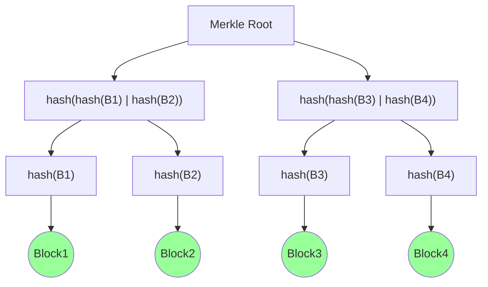

> Good seminar things: 33, 36, 47
> Semi-good: 61, 66


# Course Outline

- Two parts
  - "Tradional" lectures *(Weeks 1-5)*
    - Advanced Security Algorithms and Protocols
      - Main focus on **Blockchain** Technology
      - Secret sharing, Blink Signatures, Zero Knowledge Proofs
  - Seminar Presentations *(Weeks 6-13)*
    - Selection of Security Topics
    - Presented by students
- (Almost) everything is on Blackboard
  - Lecture Slides
    - Available after the lecture
    - For any problems, class exercises, complete solutions are provided on the slides
  - Information on Seminars
  - Information on Projects
  - Textbook (pdf), additional reading material
  - Tutorial(s)
  - Announcements
  - Blackboard discussion forum:
    - any course related questions, discussions, ...
    - You can use it to form **seminar teams**, **project teams**, discuss topics
- Assumed Background
  - Solid understanding of basic security concepts (e.g. as covered in coms3000)
    - Confidentiality, Integrity, Authentication, Non-repudiation, Availablity
    - Basic Cryptography
      - Basic concepts, e.g. entropy
      - Cryptographic Hash functions
      - Secret-key cryptography, OTP, AES, ...
      - Public-key cryptography, RSA, ...
        - Public-key signatures
    - Network Security Protocols, e.g. SSL/TLS
- Teaching and Learning Activities
  - First 2 hours
    - Lectures/Seminar Presentations
  - Third hour
    - Flexible use
      - Only 1 (or 2) **Tutorial(s)** in traditional format covering some of the material Lectures of Weeks 1-5
        - Will make announcement when Tutorial will be held
        - Tutorial Questions and Answers will be made available
        - In weeks with no tutorials, I will be available during the 3^rd^ hour for seminars, if needed

## Teaching Plan

| Week | Lecture Topic                                                |
| ---- | ------------------------------------------------------------ |
| 1    | Cource Information<br />Blockchain, BitCoin                  |
| 2    | BlockChain, BitCoin                                          |
| 3    | BlockChain, BitCoin                                          |
| 4    | Industry Guest Lecture, Peter Robinson, Consensys<br />"Introduction to Ethereum BlockChain Platform" |
| 5    | Advanced Algorithms and Protocols:<br />Secret Sharing, Blink Sharing, Zero Knowledge Proofs, ... |
| 6    | *No lecture due to public holiday*                           |
| 7-12 | Seminar Presentations                                        |
| 13   | Seminar Presentations<br />Information on Final Exam         |

## Assessment

- Seminar Presentation: 25%
  - Marking Criteria:
    - Understanding of concepts, critical discussion
      - Difficulty of paper/topic is considered
    - Quality of Presentation (clarity, technical correctness, etc)
    - **Important:** If you are not able to give your scheduled seminar presentation, you will need to provide documentation (medical, etc)
- Seminar Participation: 10%
  - Level of active participation, quality and quantity of contributions
  - You are required to be prepared and actively participate in the discussion
  - **Attendance of Seminars is required**, except in special circumstances, e.g. medial reasons
    - Let me know if you cannot attend
  - Teams of 2
  - Researching, outlining, explaining and critically discussing security topic/paper
    - You can choose a research paper or topic
  - 20 minutes, plus ~5-10 minutes questions and discussion
    - ~4 presentations per week
  - **Selection needs to be made by the end of week 4!**
- Project: 25%
  - In teams of 4 (or possibly 5) students
  - You need to email me a project proposal
    - *CC to all team members*
    - Max 1 page summary of what you want to do
      - Project Team (names, student ID)
      - What (scope)?
      - How (approach, methodology)?
      - Needs to be of reasonable scope, complexity etc
      - Proposal is due by **end of Week 5 at the latest**
        - Earlier is better, to give you more time
        - I'm available to discuss project ideas
      - Project can be purely implementation based and/or have research component
  - Project Report
    - Basic Structure:
      - Title Page *(Project Title, Team members, course details)*
      - Abstract *(Very brief summary of report, e.g. ~100 words)*
      - Introduction *(Goal, scope of project, high level summary of achievements/contributions)*
      - Background
      - Body of Report *(Discussion of Contribution)*
      - Evaluation/Discussion/Conclusion
    - 3000 — 5000 words
- Final Exam: 40%
  - Covering Material presented in Lectures and Seminars
  - Open Book

# Bitcoin, Blockchain, Distributed Ledger, Cryptocurrencies

> TODO: Add lecture notes

- "Nerd Technology" or Distributed Ledger
  - Recently the latter option
    - Potentially huge, disruptive impact, significant investment
      - There is alos a lot of hype and misinformation
    - It has a lot of interesting crypto algorithms/technology


## Blockchain

Blockchain (sometimes called Distributed Ledger) is the underlying technology on top of which Bitcoin and other cryptocurrencies are built. While cryptocurrencies such as Bitcoin have been the original application, Blockchain technology has a much wider range of applications.

- Potential applications:
  - Finance, IoT, Energy, ...

### Digital Cash

- Not a new idea, has been around for a while
- What are properties of physical cash, that we would want in Digital Cash?
  - Forgery (counterfeit)-proof
  - Anonymity (at least to some extent)
  - Cannot be spent multiple times
    - "Double Spend" problem

```sequence
Customer->Bank: Give me coins
Bank->Customer: Coins
Customer->Merchant: Coins
Merchant->Bank: Deposit
Bank->Merchant: Ok
Merchant->Customer: Product or Service
```

- eCash Transaction
  - Each eCash coin has a unique identifier or "serial number"
- **Forgery** can be avoided by ...
  - Bank can digitally signing each coin
  - Creation of valid coin requires knowing private key, everybody can verify
- How can we avoid **double spending**?
  - In Step 4, bank checks if the coin has already been spent (keeps list of serial numbers of all issued and spent coins)
    - Each coin can only be used once
- What about **anonymity**?
  - You might not want the bank to know what you spend your eCash on.
  - Bank can trace coins. How?
    - match serial numbers of issued coins and the ones received from merchant
  - This is a bit more tricky to solve
  - Chaum's famous 1983 paper provided a new cryptographic solution
    - **Blind Signatures**

#### Blind Signatures

- Signer can provide a valid signature without seeing what he/she is signing
- How can we use Blind Signatures to solve the anonymity (untraceability) problem in eCash?
  - Customer creates a random serial number (sufficiently large to avoid collisions)
  - Sends "blinded" serial number to bank
  - Bank uses blind signature algorithm to issue a valid coin for this serial number and for the required amount, and deducts amount from user's account
    - Bank cannot see serial number!
  - Customer can then "unblind" the signature, and spend valid coin at merchant
  - Merchant sends coin to bank for checking
  - Bank checks that it is a valid coin (valid signature), and has not been spent yet, based on serial number, and adds serial number to its "spent" list
  - Important:
    - **Bank cannot link serial number in coin to the customer to whom it was issued!**


#### DigiCash

- David Chaum founded company **DigiCash** in 1989, based on eCash idea
  - Attracted a lot of venture capital initially, but struggled to attract a large customer base
  - Bought by Mercantile Bank, a large issuer of credit cards
  - DigiCash went bankrupt in 1998
  - David Chaum
    - "As the Web grew, the average level of sophistication of users dropped. It was hard to explain the importance of privacy to them"
  - Credit Cards remain "currency of choice" for online payments
  - One of the claimed reasons behind the failure of DigiCash and eCash
    - **Reliance in trusted third party**


### A New Approach — BitCoin

- Idea published in 2008 via a mailing list
  - Satoshi Nakamoto, "BitCoin: A peer-to-peer electronic cash system." (2008)
  - Implementation released as open source software in 2009
- Satoshi Nakamoto is a pseudonym
  - It is not publicly known who that person or group is
- Newsweek is 2014 reported that they had tracked hime down, but that was not the case
- It is suggested that he/she probably owns about $10-20 Billion worth of BitCoins

#### What is it?

- Digital currency, **Cryptocurrency**
- A protocol and data structure (Blockchain)
  - Our focus
- A unit of (digital) money
  - Exchange rate is very volatile
- Digital asset and payment system

#### How does it work?

- All transactions are stored in a data base, or "public ledger"
  - Called the "blockchain"
- Public ledger is decentralised, i.e. maintained by a Peer-to-Peer (P2P) network
  - No need for a trusted centralised entity, e.g. bank
- Consensus is achieved through a "proof-of-work" mechanism
  - Why do we need consensus?
  - Need to agree on a common state of the ledger
- Bitcoin uses a few cryptographic "building blocks"
- We will briefly discuss/recap these

#### Bitcoin Crypto Building Blocks

- Cryptographic Hash Functions
- Hash Pointers, Blockchain
- Merkle Tress
- Proof of Work methods, "Hashcash"
- Digital Signatures


## Cryptographic (one-way) Hash Function

- Properties of $h()$
  - Compression
    - "Any size" input, fixed size output, e.g. 256, SHA-256, used in Bitcoin
  - "Easy", "efficient" to compute
  - One-way property
    - For $y=h(x)$, it is **computationally infeasible** to find $x$
    - Also called **pre-image resistance**
  - Collision resistance
    - It is computationally infeasible to find any two distinct inputs $x_1$ and $x_2$ so that $h(x_1) = h(x_2)$
      - Collisions do exist, actually there are an infinite number of them
- Also called digital fingerprint or message digest
- Compact way to remember what files or blocks of data we have seen
- If two files have the same hash, we can be confident that they are the same
- Cryptographic One-way Hash is a mouthful, from now on I will just use "hash" for short

### Ideal One-way Cryptographic Hash Function "Random Oracle" Model

- A machine with an input and an output (Blackbox)
- There is an "Elf" inside the machine, who has:
  - A very long piece of paper
  - A pen
  - An unbiased coin
- When input arrives:
  - Has the input arrived before?
    - Yes: give same output as last time (required for any function)
    - No: toss coin for new output (one toss per bit); record input and output
- Given such a hash function, what's the best approach for finding an input $x$ that has a specific output $y=h(x)$?
  - Trial-and-error, "brute force" &rarr; probabilistic
    - There is no clever way of choosing values of $x$
    - Probability of success in a single try for 256-bit hash function?
    - $P=2^{-256}$ (like rolling a $2^{256}$ sided dice)
    - The **expected** (average) number of trails to find $x$ is $2^{256}$ (rougly the estimated number of atoms in the universe)

### Hash Pointer

- Points to a block of data (e.g. via an address), like a normal pointer
- In addition, it also stores a hash $h()$ of the data
- What does $h()$ give us?
  - We can not only retrieve the data, but we can also check the **integrity** of the data, i.e. if it has been modified


# BlockChain

- While **Blockchain** has tremendous potential, it is "over-hyped" at the moment

```flow
op1=>operation: Don't use Blockchain
op2=>operation: Private Permissioned Blockchain
op3=>operation: Public Permissioned Blockchain
op4=>operation: Permissionless Blockchain
cond1=>condition: Do you need
to store state?
cond2=>condition: Are there
multiple writers?
cond3=>condition: Can you use
an always online
TTP?
cond4=>condition: Are all
writers known?
cond5=>condition: Are all
writers
trusted?
cond6=>condition: Is public
verifiability
required?

cond1(no)->op1
cond1(yes)->cond2
cond2(no)->op1
cond2(yes)->cond3
cond3(no)->cond4
cond3(yes,right)->op1
cond4(no,bottom)->op4
cond4(yes)->cond5
cond5(yes,right)->op1
cond5(no)->cond6
cond6(yes)->op3
cond6(no)->op2

```

- We can use hash pointers to build data structures, e.g. a linked list
  - It's called a blockchain
- Having the hash pointer to the head of the list protects the integrity of the entire list or chain (e.g. tamper proof (evident) log file)
  - Need to store hash pointer to the head of the list externally to list
- Hash is computed over entire block, including header, which includes hash pointer to previous block
- The hash of the Gensis block is stored in the next block and the hash of that block is stored in the next and so on so forth
- If an attacker wants to modify a block then all the blocks afterwards need to have their hashes regenerated otherwise the hashs won't line up. And since the head of the chain is stored somewhere, it is hard to update that


## Membership Test

- How can we verify the membership of a block $B$ in the chain?
  - e.g. in Bitcoin, we might want to check if a certain transaction is part of a block
- We need to traverse the chain from the head, until we find $h(B)$ in one of the block headers
- Cost of Linear, $O(N)$, where $N$ is the number of blocks

### Merkle Trees (or Hash Trees)

- Named after Ralph Merkle



- Can protect integrity of large number of data blocks, like a Blockchain
- We only need the "Root Hash" at the root of the tree (**"Merkle Tree"**)
- Modification of any data block by attacker results in different hashes all the way up to the Merkle Root, and can easily be detected
- Cost: $O(\log_2N)$


## "Blockchain Stack"

- The Blockchain can be considered a building block or platform, on top of which a wide range of applications can be built
  - Similar to TCP/IP for the Internet
- Bitcoin is just one example (the most famous) of such applications


## Proof-of-Work-System

- A computational proof-of-work system, is a puzzle that can be solved by doing a certain amount of computation
- Properties
  - Easy to verify result
  - Easy to generate
  - Difficulty of puzzle should be adjustable and predictable (average)

### HashCash

- Approach used in Bitcoin is based on:
  - Adam Back, "Hashcash — A Denial of Service Counter-Measure", TR, 2002
- Original Goal
  - Prevent or mitigate **denial-of-service attacks** (e.g. TCP SYN flooding) or email SPAM

```sequence
Client->Server: Request Service
Server->Server: Choose
Server->Client: Challenge
Client->Client: Solve
Client->Server: Response
Server->Server: Verify
Server->Client: Grant Service
```

- Puzzle idea is based on hash function
  - Just require the first $n$ bits of $h(x)$ to have a given value, e.g. the first $n$ (most significant) bits of $y=h(x)$ are all "0" (partial pre-image)
    - Same as finding a pre-image for an $n$-bit hash function
  - Alternatively, this can be expressed as saying that $h(x)<T$
- Brute force is the best approach to solve this puzzle
- $2^n$ is the chance of getting the result on a single try and also the average number of tries before success is made
- Does it meet all the Puzzle requirements?
  - Easy to verify
    - Yes, just compute $h(x)$ and check result
  - Easy to generate
  - Difficulty is adjustable and predictable
    - Simply adjust $n$
    - Expected work factor is $2^n$
- Important
  - This is probabilistic. You could be lucky and find the answer in your first try

> In Bitcoin, the goal is to have a solution to a puzzle (confirmation of a block) roughly every 10 minutes
> Difficulty is adjusted every 2016 blocks (~2 weeks) to maintain the 10 minute puzzle solution time


# Public Key Cryptography

## Digital Signatures

- Properties of signatures (in general)
  - Only **you** can provide a valid signature, anyone can verify
  - Signature is tied to a particular document, cannot be copy-pasted to another document
- Public Key Cryptography
  - Asymmetric operation
  - Two keys: **Public Key** and **Private Key**
- Encryption
  - Encryption with **Public Key**
  - Decryption with **Private Key**
  - Key Benefit (pun intended)?
    - Simplified key distribution/management
  - Remaining security problem?
    - Authenticity of public key
    - Public Key Certificates (map public key to identity)
- Digital Signature
  - Sign with Private Key
  - Verification with Public Key


### Public Key Signatures

- Since public key operations are computationally expensive, digital signatures are typically applied to a hash, rather than entire file or block of data

### Digital Signatures in Bitcoin

- Bitcoin transactions have digital signatures
  - Signed by the owner(s) of the source funds (Bitcoin to be transferred)
  - This proves ownership of funds
  - Prevents forgery of coins/transactions
- An identity in Bitcoin (a "Bitcoin Address") is simply a public key (160-bit hash of it, to be precise)
  - No need for public key certificates
  - No need to link public key to a real name
- Bitcoin uses Elliptic Curve Digital Signature Algorithm


# Cryptocurrecny

- One global whiteboard example (Classroom Example from lecture) is essentially how Bitcoin works
- Difference
  - We cannot assume people are in the same physical location
  - A cryptocurrency should work over the Internet
- How can we achieve
  - Broadcasting of transactions
    - Untrusted P2P Network, flooding (as used in Bitcoin)
  - Avoiding forgery (transactions, coins)
    - Digital Signatures
  - Maintaining the public ledger
    - P2P Network
    - **Proof-of-work system + Incentive mechanism &rarr; distributed consensus**

